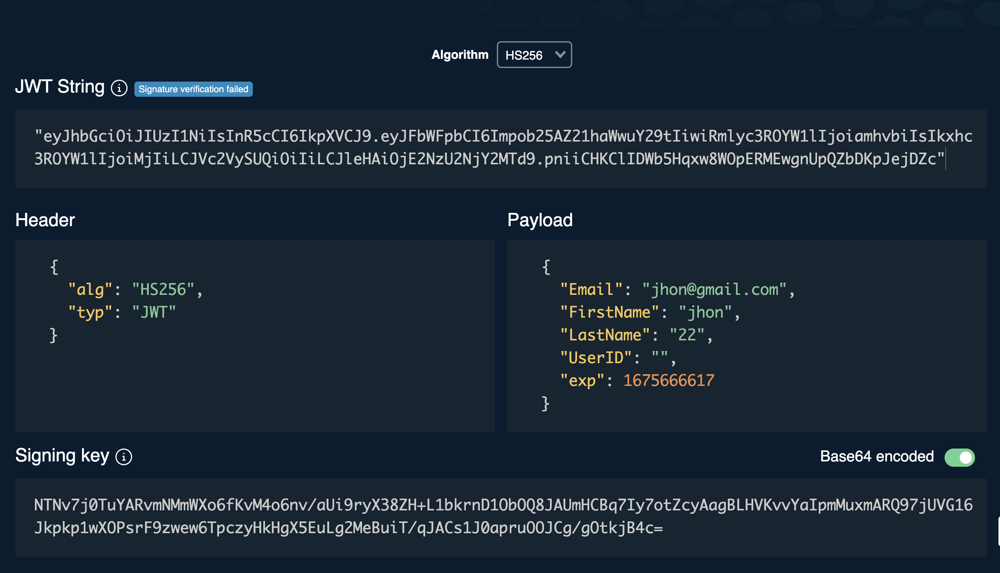
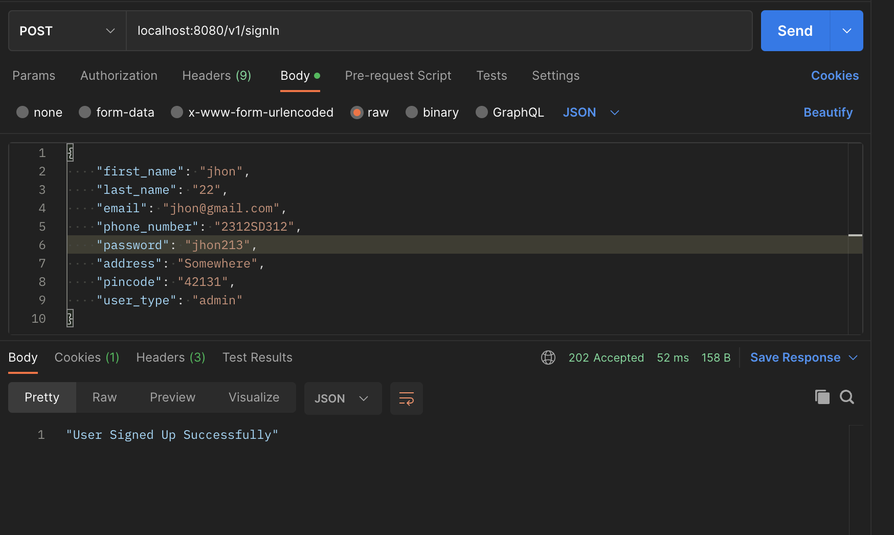
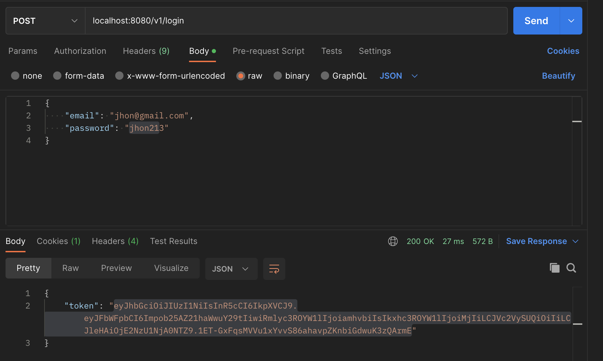
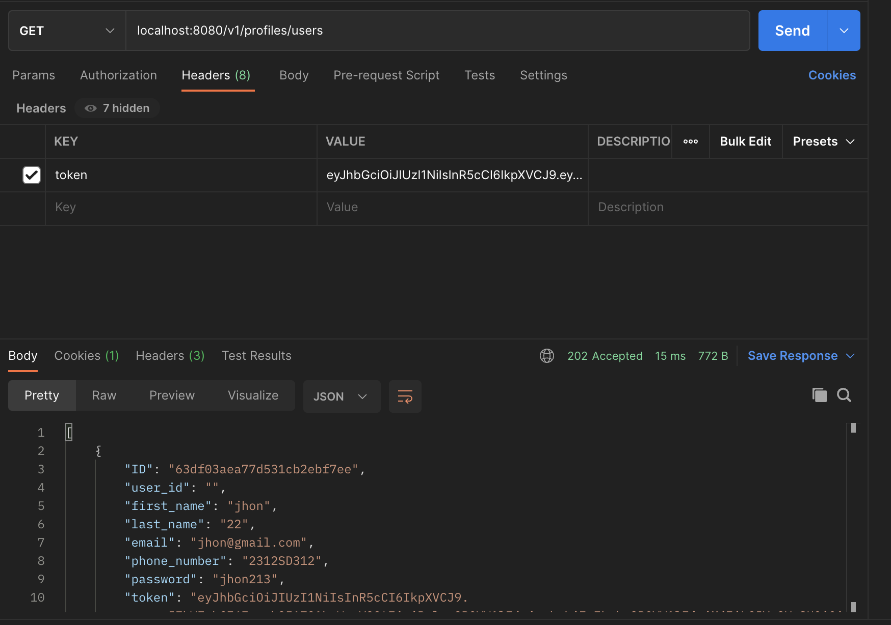
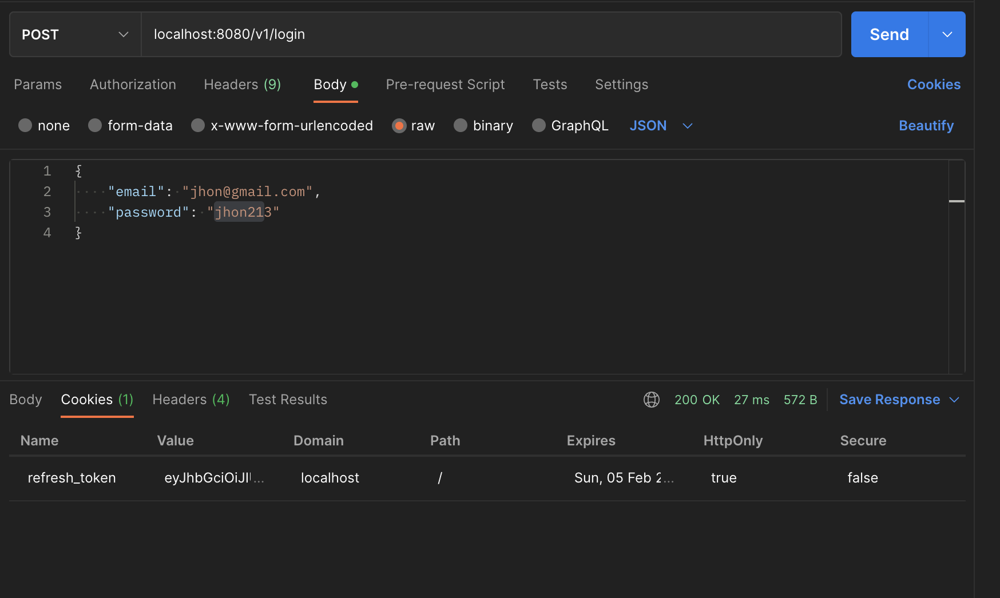

# Role Based Authentication using JWT Authentication 

This project can be used for simple JWT based authentication and User Mangement solution along with other microservices.

JWT token is client side authentication where server just needs to decode the token to and extract the claims to identify the the correct authorizations of the users.

Sample Decoding of JWT Token:

**Dependency:** 

* Authentication Server (Gin) 
* MongoDB
* github.com/golang-jwt/jwt
* go.mongodb.org/mongo-driver/mongo

The project demonstrates following features:
 
* JWT Authentication Implementation
* SignIn/Login Api Implementation
* Reset Password Implementation
* Middleware Implementation
* Role Based Authentication

## API Requests:

**1.SignIn API**

 

**Implementation:**

User should be able to sign in and load all the details into single entry in mongoDB with all validations    

**Task:**
* API Defination and Models 
* Validation Logic and DB insertion 
* Return Response and Error Handling

**2.Login API**

Implementation:

User should be able to verify the password and email as per in the database and generate a new token and refresh token and return back in the response.    

**3.API access using Token**

All other API have middleware implementation which verifies the token before granting access to the particular api.

This api shows the use of JWT Authentication middleware...    

**4.Refresh Token :**

Refresh Token API using HTTP-Only cookie

 
5.Password Reset:

